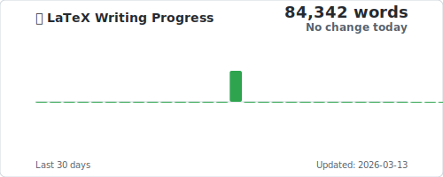

## Hi there 👋

### 📝 LaTeX Writing Progress

This chart shows my daily progress writing academic papers in LaTeX:

*Updated automatically every day. Tracks word count changes across all my repositories.*

---

<!--
**tkharisov7/tkharisov7** is a ✨ _special_ ✨ repository because its `README.md` (this file) appears on your GitHub profile.

Here are some ideas to get you started:

- 🔭 I'm currently working on ...
- 🌱 I'm currently learning ...
- 👯 I'm looking to collaborate on ...
- 🤔 I'm looking for help with ...
- 💬 Ask me about ...
- 📫 How to reach me: ...
- 😄 Pronouns: ...
- ⚡ Fun fact: ...
-->

## Setup

To enable the LaTeX writing progress tracker, you need to create a Personal Access Token (PAT):

1. Go to [GitHub Settings → Developer settings → Personal access tokens → Fine-grained tokens](https://github.com/settings/tokens?type=beta)
2. Create a new token with:
   - **Repository access**: All repositories (to access private repos)
   - **Permissions**: Contents (Read-only)
3. Copy the token
4. Go to this repository's Settings → Secrets and variables → Actions
5. Create a new secret named `PAT_TOKEN` with the token value

The workflow runs daily at midnight UTC and can also be triggered manually from the Actions tab.
